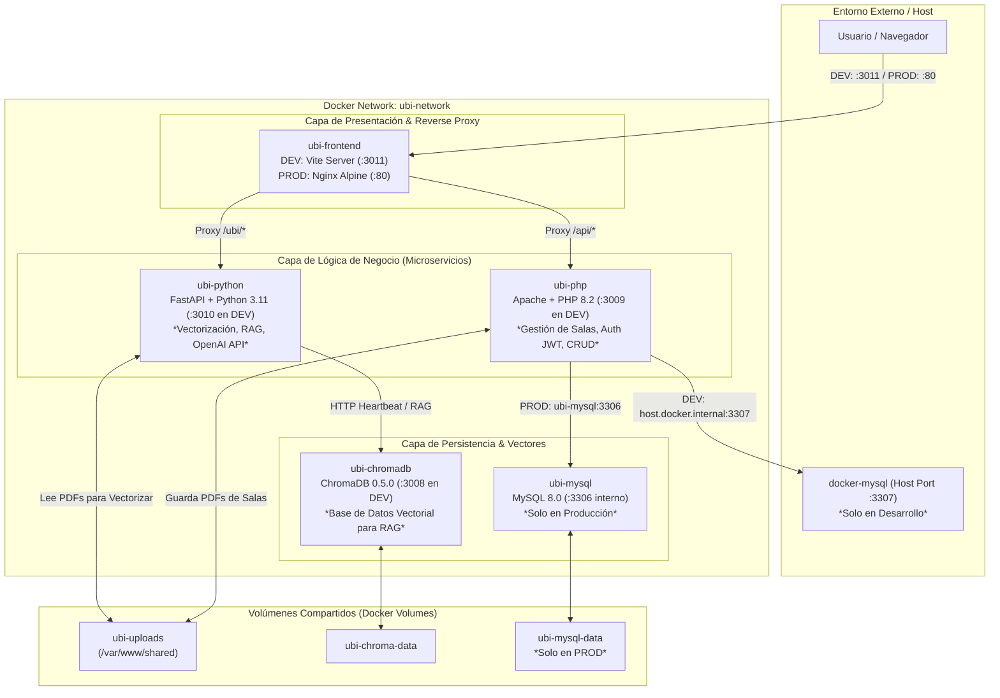

# 🚀 Guía Definitiva de Despliegue Docker (DEV & PROD) — UBI

Esta guía detalla toda la arquitectura, configuración, variables de entorno y comandos necesarios para levantar y operar el proyecto **UBI (Asistente Virtual con IA de CEIPA Business School)** en entornos de **Desarrollo (DEV)** y **Producción (PROD)** utilizando Docker y Docker Compose multi-stage.

---

## 🏛️ Arquitectura del Sistema

El proyecto está dividido en un ecosistema de microservicios contenerizados que se comunican de forma segura a través de una red privada Docker (`ubi-network`).



### 🔹 Diferencia Clave entre DEV y PROD
1. **Base de Datos MySQL**:
   - **En DEV (`docker-compose.dev.yml`)**: No se levanta un contenedor MySQL propio para evitar conflictos de puertos o recursos. En su lugar, el servicio `ubi-php` se conecta a tu instancia MySQL existente en la máquina host (en el puerto `3307`) mediante `host.docker.internal`.
   - **En PROD (`docker-compose.prod.yml`)**: Se levanta un contenedor dedicado `ubi-mysql-prod` (MySQL 8.0) que **ejecuta automáticamente** el script SQL `db/sql-ubi-12_24.sql` en su primer arranque para crear tablas y stored procedures.
2. **Volúmenes de Código (Hot-Reload)**:
   - **En DEV**: Se utilizan *bind mounts* (`./api_php:/var/www/html/api`, etc.) para que cualquier cambio en tu código local en React, PHP o Python se refleje al instante sin reconstruir la imagen.
   - **En PROD**: No hay bind mounts. El código se empaqueta de forma inmutable dentro de las imágenes multi-stage optimizadas para producción.
3. **Seguridad y Exposición de Puertos**:
   - **En DEV**: Exponemos los puertos locales desde el `3008` al `3011` para facilitar la depuración de cada microservicio por separado.
   - **En PROD**: **Solo Nginx (puerto `80`)** es accesible desde el exterior. Las bases de datos y APIs backend quedan aisladas dentro de `ubi-network`.

---

## ⚙️ Variables de Entorno (.env.dev vs .env.prod)

El proyecto utiliza un sistema de variables de entorno con resolución dinámica (`getenv` en PHP y `os.environ` en Python). 
Existe un archivo [.env.example](file:///Users/matt/Documents/ubi/MAICITO/.env.example) que sirve como plantilla.

### 🔑 Variables Críticas a Configurar:

| Variable | Descripción | Valor DEV Recomendado | Valor PROD Recomendado |
| :--- | :--- | :--- | :--- |
| `OPENAI_API_KEY` | Llave de API de OpenAI para el modelo Catedrático IA | `sk-tu-llave-real` | `sk-llave-produccion` |
| `APP_ENV` | Define el modo de ejecución (afecta CORS y logs) | `development` | `production` |
| `DB_HOST` | Host de conexión a MySQL | `host.docker.internal` | `ubi-mysql` |
| `DB_PORT` | Puerto de MySQL | `3307` | `3306` |
| `DB_USER` / `DB_PASSWORD` | Usuario y clave de MySQL | `root` / `ubi_dev_2024` | `root` / `ClaveSeguraProd` |
| `CHROMA_HOST` | Host del vector store | `ubi-chromadb` | `ubi-chromadb` |
| `CHROMA_PORT` | Puerto del vector store | `8000` | `8000` |
| `MAIL_HOST` / `MAIL_USER` | Configuración SMTP para notificaciones | `smtp.office365.com` / correo | `smtp.office365.com` / correo |
| `UPLOAD_PATH` | Ruta compartida para archivos | `/var/www/shared/files` | `/var/www/shared/files` |
| `PDF_STORAGE_PATH` | Ruta compartida para PDFs de salas | `/var/www/shared/pdf_questions` | `/var/www/shared/pdf_questions` |

> [!IMPORTANT]
> **Seguridad en Git**: El archivo [.gitignore](file:///Users/matt/Documents/ubi/MAICITO/.gitignore) está configurado con la regla `.env.*` (excepto `!.env.example`) para garantizar que **nunca** subas por error tus llaves de OpenAI o contraseñas a GitHub.

---

## 🛠️ Instrucciones de Despliegue: Desarrollo (DEV)

En desarrollo tienes recarga en vivo (hot-reload) y acceso directo a todos los servicios para inspección y debugging.

### 1️⃣ Preparación
Asegúrate de copiar la plantilla y colocar tu API Key de OpenAI en el archivo `.env.dev`:
```bash
cp .env.example .env.dev
# Edita .env.dev con tu editor favorito y asegúrate de poner tu OPENAI_API_KEY
```
Verifica también que tu contenedor MySQL del host (`docker-mysql`) esté corriendo en el puerto `3307`.

### 2️⃣ Levantar los Servicios en DEV
Para construir y arrancar los 4 contenedores en segundo plano (`-d`):
```bash
docker compose -f docker-compose.dev.yml up --build -d
```

### 3️⃣ Verificación de Estado y Logs
Para ver los logs en tiempo real de todos los servicios (o uno específico):
```bash
# Todos los logs en vivo
docker compose -f docker-compose.dev.yml logs -f

# Ver solo los logs de Python o PHP
docker compose -f docker-compose.dev.yml logs -f ubi-python
```

### 🌐 Puertos y Puntos de Acceso en DEV:
- 🖥️ **Panel Admin (Frontend Vite)**: [http://localhost:3011](http://localhost:3011)
- 🐘 **API PHP (Microservicios REST)**: [http://localhost:3009](http://localhost:3009)
- 🐍 **API Python (FastAPI Swagger Docs)**: [http://localhost:3010/docs](http://localhost:3010/docs)
- 🔮 **ChromaDB (Heartbeat Health)**: [http://localhost:3008/api/v1/heartbeat](http://localhost:3008/api/v1/heartbeat)

---

## 🏢 Instrucciones de Despliegue: Producción (PROD)

En producción, Docker empaqueta el código en builds optimizados y levanta una infraestructura autocontenida (incluyendo su propia base de datos MySQL).

### 1️⃣ Preparación de Variables de Producción
Configura el archivo `.env.prod` con contraseñas fuertes y la llave de OpenAI de producción:
```bash
cp .env.example .env.prod
# Configura contraseñas seguras y APP_ENV=production
```

### 2️⃣ Levantar los Servicios en PROD
Para construir y lanzar la suite completa en producción:
```bash
docker compose -f docker-compose.prod.yml up --build -d
```

> [!NOTE]
> En el **primer arranque**, el servicio `ubi-mysql-prod` tardará unos segundos extra mientras ejecuta automáticamente el dump [db/sql-ubi-12_24.sql](file:///Users/matt/Documents/ubi/MAICITO/db/sql-ubi-12_24.sql) para crear las tablas, usuarios y stored procedures.

### 🌐 Puntos de Acceso en PROD:
- 🌍 **Aplicación Principal (Nginx Reverse Proxy)**: [http://localhost](http://localhost) (Puerto `80` o dominio configurado).
  - El frontend estático se sirve desde la raíz `/`.
  - Las peticiones hacia `/api/*` son redirigidas internamente por Nginx hacia `ubi-php:80`.
  - Las peticiones hacia `/ubi/*` son redirigidas internamente hacia `ubi-python:8000`.
  - El **widget de chat embebible** se sirve como archivo estático en `/script/index.js` (proviene de `admin/public/script/index.js`), para incrustar el chat en sitios externos con el snippet que genera el botón "Copiar Script" del panel.

---

## 📂 Detalles de Arquitectura y Archivos Clave

### 📄 Dockerfiles Multi-Stage
1. **[admin/Dockerfile](file:///Users/matt/Documents/ubi/MAICITO/admin/Dockerfile)**:
   - Target `dev`: Usa `node:20-alpine` y arranca el servidor de desarrollo Vite en el puerto 5173.
   - Target `prod`: Compila el bundle con `npm run build` y sirve los estáticos usando un servidor `nginx:alpine` super ligero.
2. **[api_ubi_python/Dockerfile](file:///Users/matt/Documents/ubi/MAICITO/api_ubi_python/Dockerfile)**:
   - Target `dev`: Usa `python:3.11-slim`, instala dependencias y corre `uvicorn` con el flag `--reload`.
   - Target `prod`: Arranca `uvicorn` con **16 workers** concurrentes para manejar alta demanda en paralelo.
   - *Nota de compatibilidad*: Se eliminaron de [requirements.txt](file:///Users/matt/Documents/ubi/MAICITO/api_ubi_python/requirements.txt) librerías exclusivas de Intel/Windows (`intel-openmp`, `mkl`, `tbb`, `pyreadline3`) para garantizar una compilación perfecta y nativa en arquitecturas **ARM64 (Apple Silicon M1/M2/M3)** y servidores Linux.
3. **[api_php/Dockerfile](file:///Users/matt/Documents/ubi/MAICITO/api_php/Dockerfile)**:
   - Basado en `php:8.2-apache`. Instala extensiones `mysqli` y `zip`, habilita módulos `mod_rewrite` y `mod_headers`, y ejecuta Composer desde el binario `/usr/bin/composer`.
4. **[db/Dockerfile](file:///Users/matt/Documents/ubi/MAICITO/db/Dockerfile)**:
   - Basado en `mysql:8.0`. Copia tu dump SQL en `/docker-entrypoint-initdb.d/01-init.sql` para inicialización automática.

### 🔄 Funcionamiento del Volumen Compartido (`ubi-uploads`)
Para que el bot de IA pueda responder preguntas de documentos académicos, existe un flujo de archivos entre PHP y Python:
1. El usuario administrador entra al frontend React y sube un PDF a una "Sala".
2. La API en PHP ([api_php](file:///Users/matt/Documents/ubi/MAICITO/api_php)) recibe el archivo y lo almacena en `/var/www/shared/pdf_questions/`.
3. La API en Python ([api_ubi_python](file:///Users/matt/Documents/ubi/MAICITO/api_ubi_python)) lee el archivo exactamente en esa misma ruta compartida (`/var/www/shared/pdf_questions/`), extrae el texto, lo fragmenta y lo almacena como vectores en ChromaDB.
4. Al estar montado en el volumen Docker `ubi-uploads`, **ambos contenedores ven los mismos archivos de manera instantánea** sin necesidad de transferencias por red.

---

## 🧰 Solución de Problemas Comunes (Troubleshooting)

### ❓ 1. Instalé una nueva librería en React, Python o PHP y no funciona
Cuando instalas un paquete nuevo (`npm install`, `pip install`, o `composer require`), debes reconstruir la imagen Docker para que incluya las nuevas dependencias:
```bash
docker compose -f docker-compose.dev.yml up --build -d
```

### ❓ 2. El contenedor PHP no se conecta a MySQL en Desarrollo (`Connection refused`)
En desarrollo, PHP se conecta a la máquina host usando la regla `host.docker.internal`. Si falla:
1. Verifica que tu contenedor MySQL del host esté corriendo en el puerto `3307`.
2. Verifica en tu [.env.dev](file:///Users/matt/Documents/ubi/MAICITO/.env.dev) que tengas `DB_HOST=host.docker.internal` y `DB_PORT=3307`.
3. Asegúrate de que tu contraseña en `DB_PASSWORD` sea idéntica a la de tu MySQL local.

### ❓ 3. ChromaDB o la API de Python muestran error de conexión
En `chromadb_manager.py` hemos configurado un **health check HTTP** hacia `http://localhost:8000/api/v1/heartbeat`. En Docker Compose, Python espera automáticamente a que ChromaDB esté listo antes de arrancar. Si necesitas reiniciar solo la capa de inteligencia artificial:
```bash
docker compose -f docker-compose.dev.yml restart ubi-python ubi-chromadb
```

### ❓ 4. ¿Cómo limpiar toda la base de datos, volúmenes temporales y empezar de cero?
Si deseas borrar todos los contenedores y resetear las bases de datos y volúmenes a su estado inicial:
```bash
# En Desarrollo
docker compose -f docker-compose.dev.yml down -v

# En Producción
docker compose -f docker-compose.prod.yml down -v
```
*(El argumento `-v` elimina los volúmenes de Docker, por lo que la base de datos y los vectores de ChromaDB se crearán desde cero en el siguiente `up`).*
